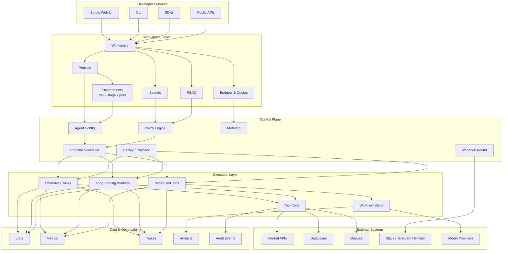
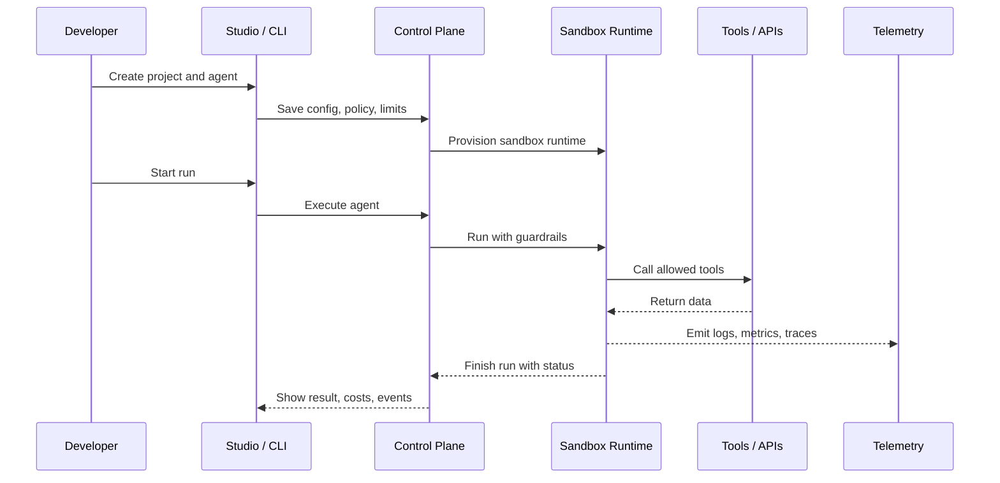

<p align="center">
  
</p>

<h1 align="center">YOLO Labs AI</h1>

<div align="center">
  <p><strong>Safe sandbox infrastructure for AI agents, workflows, and developer tooling</strong></p>
  <p>Studio • Sandboxes • Agents • Guardrails • Observability • Budgets</p>
</div>

<br />

<div align="center">

[](https://your-web-app-link)
[](https://your-docs-link)
[](https://your-cli-link)
[](https://your-sdk-link)
[](https://x.com/your_account)
[](https://t.me/your_group_or_channel)

</div>

---

> [!IMPORTANT]
> YOLO Labs AI is built for running agents inside isolated sandbox environments rather than directly on production systems

> [!TIP]
> The fastest way to understand the product is to think of it as a developer studio plus a controlled execution layer for AI agents

> [!WARNING]
> Agents can call tools, workflows, and external services, so policies, reviews, and sandbox boundaries still matter even when guardrails are enabled

> [!NOTE]
> The platform is designed for teams that want speed without giving up visibility, cost control, or tenant isolation

## What is YOLO Labs AI

YOLO Labs AI is a studio for building, testing, and running AI-powered agents inside safe sandboxes

Instead of wiring custom execution layers, policy systems, and observability from scratch for every new AI feature, teams use one shared platform for controlled runtime execution, agent orchestration, tooling, telemetry, and cost governance

It is not just a chat surface and not just an agent builder

It is a product layer for developers who need a place where agents can act, but only inside clear boundaries

---

## What’s Broken

Most teams start with a promising agent demo and then hit the same wall

The model looks good in isolation, but the real product around it becomes messy fast

<table>
  <tr>
    <th align="left">Current workflow</th>
    <th align="left">Where time or money is lost</th>
    <th align="left">Why existing solutions fail</th>
  </tr>
  <tr>
    <td>Connect model to internal APIs and tools</td>
    <td>Unsafe calls, unclear permissions, brittle wrappers</td>
    <td>Most stacks focus on prompting, not controlled execution</td>
  </tr>
  <tr>
    <td>Run experiments on shared infra or ad hoc workers</td>
    <td>Risk of runaway loops, noisy jobs, and accidental blast radius</td>
    <td>Isolation is usually bolted on late, not designed in first</td>
  </tr>
  <tr>
    <td>Debug failures after the fact</td>
    <td>Missing traces, fragmented logs, hard-to-replay sessions</td>
    <td>Telemetry is spread across too many tools and layers</td>
  </tr>
  <tr>
    <td>Manage spend manually</td>
    <td>Token burn, compute waste, storage creep, budget surprises</td>
    <td>Most agent tools expose usage, but not real controls</td>
  </tr>
</table>

### The concrete pain

Teams want to move fast with ops agents, internal copilots, analytics workflows, or automated developer tools

What they get instead is a fragile chain of prompts, wrappers, API keys, custom scripts, half-finished monitoring, and late-stage security fixes

That is where time disappears

That is also where trust disappears

---

## The Shift

YOLO Labs AI changes the mental model from **"run agents on top of your stack"** to **"run agents inside a controlled execution product"**

<table>
  <tr>
    <th align="left">Instead of</th>
    <th align="left">YOLO Labs AI does</th>
  </tr>
  <tr>
    <td>Running agents directly against production systems</td>
    <td>Runs them inside isolated sandboxes with policies and quotas</td>
  </tr>
  <tr>
    <td>Trusting prompts to behave well</td>
    <td>Applies runtime guardrails, tool limits, network rules, and hard caps</td>
  </tr>
  <tr>
    <td>Stitching together logging, tracing, and billing later</td>
    <td>Ships observability and metering as built-in platform primitives</td>
  </tr>
  <tr>
    <td>Building a one-off execution layer for every project</td>
    <td>Gives every workspace a common base for agents, workflows, and integrations</td>
  </tr>
</table>

### New mental model

YOLO Labs AI is one workspace with multiple surfaces around it and one controlled runtime underneath it



---

## Proof

The product becomes real when the workflow changes in a visible way

### Before → After

| Before | After with YOLO Labs AI |
|---|---|
| Agent logic is scattered across scripts, wrappers, and cloud jobs | Agents, runtimes, and policies live inside one workspace model |
| Experiments leak into shared infrastructure | Sandboxes isolate execution with strict resource and network boundaries |
| Costs are discovered after invoices arrive | Budgets, quotas, and usage dashboards are part of the platform |
| Debugging depends on too many external tools | Logs, metrics, traces, and audit events are unified |
| Safety is manual and inconsistent | Guardrails and evaluation become part of the delivery flow |

### Real scenario

A team wants to launch an internal operations agent that can read incident data, query internal APIs, draft follow-up actions, and trigger approved workflows

Without a controlled runtime, they end up juggling custom workers, secret injection, API wrappers, one-off logging, and manual reviews

With YOLO Labs AI, they define the agent, attach allowed tools, set policies, place it in a sandbox type, monitor its traces, and push controlled changes from dev to stage to prod through the same platform

### Metrics that matter

<table>
  <tr>
    <th align="left">Metric</th>
    <th align="left">What it proves</th>
  </tr>
  <tr>
    <td>Token usage</td>
    <td>Which agents, models, and projects are actually burning budget</td>
  </tr>
  <tr>
    <td>Runtime usage</td>
    <td>Which tasks are expensive, slow, or behaving like runaway jobs</td>
  </tr>
  <tr>
    <td>Storage usage</td>
    <td>Which workspaces are retaining logs, traces, and artifacts at scale</td>
  </tr>
  <tr>
    <td>Guardrail events</td>
    <td>Where unsafe or suspicious behavior was blocked before damage spread</td>
  </tr>
</table>

> [!IMPORTANT]
> YOLO Labs AI is valuable not because it makes agent demos possible, but because it makes agent execution reviewable, governable, and repeatable

---

## Try Core Flow

The shortest path to an actual product insight is simple

1. Create a workspace and project  
2. Choose an environment  
3. Define one agent and attach only the tools it needs  
4. Deploy it into a sandbox runtime  
5. Review logs, traces, and usage after the first run  
6. Tighten guardrails before scaling the workflow  

### What the core flow looks like



---

## Real Scenarios

## 1) Internal ops assistant

**Context**

A team wants an assistant that can inspect incidents, read internal dashboards, and prepare next actions without touching production systems directly

**Before**

The workflow depends on scripts, broad credentials, and manual reviews scattered across multiple tools

**After**

The assistant runs in an isolated sandbox with explicit tool access, full telemetry, and policy checks on every meaningful action

---

## 2) Data QA agent

**Context**

A company needs automated quality checks across structured datasets, reports, and ingestion jobs

**Before**

Validation logic lives in separate scripts, results are hard to audit, and failures are not easy to replay

**After**

The QA agent runs as a repeatable workflow, stores traces and artifacts, and exposes clear audit history for every step

---

## 3) Developer workflow runner

**Context**

A dev team wants AI-assisted routines for repository checks, CI summaries, and safe automation around GitHub and internal tools

**Before**

Every automation is a one-off with weak visibility and inconsistent permissions

**After**

Plugins, policies, hooks, and project-level environments turn those automations into managed agent workflows instead of ad hoc glue code

---

## Mechanics

Under the hood, YOLO Labs AI keeps the model layer, execution layer, and governance layer separate but connected

### Platform layers

| Layer | What it does |
|---|---|
| Studio | UI and CLI for projects, agents, environments, logs, and rollouts |
| Control Plane | Stores config, applies policies, schedules runtimes, routes telemetry |
| Runtimes | Isolated sandboxes for tasks, workers, and scheduled jobs |
| Tools & Plugins | Structured capabilities agents can call through controlled schemas |
| Data Plane | Logs, metrics, traces, artifacts, and audit records |
| Metering | Tracks tokens, compute, storage, and usage against plans |

### Example SDK shape

```ts
import { YoloLabsClient } from "@yolo-labs/sdk"

const client = new YoloLabsClient({
  apiKey: process.env.YOLO_LABS_API_KEY,
  workspaceId: "ws_demo"
})

const run = await client.agents.run({
  projectId: "proj_ops",
  environment: "dev",
  agentId: "incident_triage",
  input: {
    message: "Inspect recent failed jobs and summarize likely causes"
  }
})

console.log(run.jobId)
console.log(run.status)
```

```python
from yolo_labs import YoloLabsClient

client = YoloLabsClient(
    api_key="YOUR_API_KEY",
    workspace_id="ws_demo"
)

run = client.agents.run(
    project_id="proj_ops",
    environment="dev",
    agent_id="incident_triage",
    input={
        "message": "Inspect recent failed jobs and summarize likely causes"
    }
)

print(run["job_id"])
print(run["status"])
```

### Example job response

```json
{
  "job_id": "job_01hzk7qz0m",
  "status": "completed",
  "workspace_id": "ws_demo",
  "project_id": "proj_ops",
  "agent_id": "incident_triage",
  "usage": {
    "input_tokens": 1842,
    "output_tokens": 624,
    "runtime_seconds": 12.8,
    "storage_mb": 3.4
  },
  "result": {
    "summary": "Two failed jobs share the same upstream timeout pattern",
    "next_actions": [
      "Inspect connector latency",
      "Replay the failed batch in stage",
      "Reduce retry depth on the affected worker"
    ]
  }
}
```

> [!TIP]
> The key idea is not the shape of one API call, but that every run inherits the same workspace rules around access, budgets, telemetry, and policy enforcement

---

## vs Alternatives

| Option | Difference |
|---|---|
| Raw provider APIs | Strong model access but no native controlled execution layer |
| Agent frameworks | Good orchestration patterns but usually depend on your own infra, policy, and observability stack |
| Manual scripts and workers | Flexible for small tasks but hard to govern, audit, and scale across teams |
| Generic serverless runtimes | Good execution primitives but not designed around agent behavior, tools, evaluations, and runtime safety |

### Positioning in one line

YOLO Labs AI is for teams that do not just want to **build agents**, but want to **operate them safely as a product surface**

---

## Failure Modes

Trust grows faster when the product is honest about where it is not the right fit

| Situation | Why it may not help much |
|---|---|
| Very small one-off scripts | The full workspace and policy model may be more structure than you need |
| Single-user local experiments | A local notebook or lightweight script may be faster for throwaway tests |
| Static workflows with no meaningful tool use | If nothing needs sandboxing, metering, or policy controls, simpler stacks can be enough |
| Teams without clear internal ownership | The platform helps with boundaries, but it does not replace product or operational discipline |

### When older methods are better

If the task is tiny, temporary, isolated, and low risk, a direct script or simple job runner may still be the better tool

That is not a weakness

That is just scope honesty

---

## Core Product View

YOLO Labs AI combines developer experience, runtime execution, and governance inside one shared platform model

| Product area | Role in the system |
|---|---|
| Studio | Design, deploy, inspect, and manage agents and workflows |
| Runtimes | Execute code and agent behavior inside isolated sandboxes |
| Agents | Carry logic, tool access, policies, memory, and automation behavior |
| Workspaces | Define team boundary, billing, RBAC, and tenant isolation |
| Projects | Group environments, runtimes, and agents around one use case |
| Metering | Enforce plans, quotas, budgets, and cost alerts |
| Observability | Collect logs, metrics, traces, and audit records |
| Integrations | Connect external APIs, internal tools, webhooks, and plugins |

---

## Why teams use it

YOLO Labs AI helps teams move faster without pretending that speed and safety are opposites

It gives developers a place to experiment aggressively, but inside controlled runtime boundaries with visibility, usage controls, and tenant-aware isolation built in from the start

That is the difference between an AI demo stack and an AI execution platform

---

## Product Notes

> [!NOTE]
> Official SDKs begin with TypeScript and Python support for workspaces, projects, agents, jobs, and telemetry

> [!IMPORTANT]
> Budgets, quotas, and rate limits can be enforced per workspace, project, team, or key depending on platform configuration

> [!WARNING]
> Outputs may still be inaccurate or incomplete, and agents should not be treated as legal, financial, medical, or other professional advisors

> [!CAUTION]
> Users are responsible for validating outputs and configuring tools, policies, and integrations responsibly before using the platform in high-impact environments

---

## Status

YOLO Labs AI is an active platform direction focused on safe runtime execution, observability, and agent operations for modern developer teams

Features, limits, APIs, and supported integrations may evolve as the platform grows
